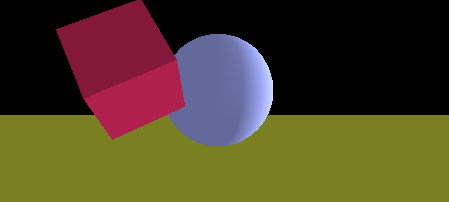

**[geotic](https://github.com/ddmills/geotic)**



```js
import 'babel-polyfill';
import { entity, component } from 'geotic';
import {
  MeshLambertMaterial as material,
  BoxBufferGeometry as box,
  PlaneGeometry as plane,
  SphereGeometry as sphere
} from 'three';
import geotic from 'geotic';
import game from './game';
import systems from './systems';
import './components';

const orb = entity()
  .add('bounds', new box(100, 100, 100))
  .add('mesh',
    new sphere(50, 16, 16),
    new material({ color: 0x8e98dd })
  );

const floor = entity().add('ground');

entity()
  .add('transform', { position: { x: 200, y: 25, z: 100 }})
  .add('velocity', { angular: {x: -.001, y: 0, z: -.001}})
  .add('mesh',
    new box(50, 50, 50),
    new material({ color: 0xbb2253 })
  )
  .add('bounds');

const rotatingLamp = entity()
  .add('light', { type: 'directional' })
  .add('velocity', { angular: { x: 0, y: 0.002, z: 0 } });

const player = entity()
  .add('controls')
  .add('mesh',
    new box(25, 50, 50),
    new material({ color: 0xe7bcec })
  )
  .add('bounds')
  .add('collision');

const camera = entity().add('camera');

entity().add('light', { type: 'ambient', intensity: .7 });

player.transform.position.x = -200;
player.transform.position.y = -5;

camera.transform.position.z = 0;
camera.transform.position.y = 600;
camera.transform.rotation.x = -Math.PI/2;

rotatingLamp.light.position.z = 15;
orb.transform.position.y = 20;
floor.transform.position.y = 20;

game.start(dt => {
  systems.controls.update(dt);
  systems.bounds.update(dt);
  systems.collision.update(dt);
  systems.velocity.update(dt);
  systems.renderer.update(dt);
});
```
